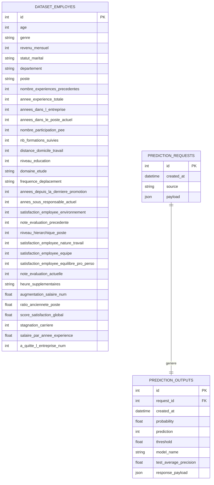

# Schéma de la base de données

Le projet utilise une base PostgreSQL locale pour stocker :

- le dataset préparé utilisé dans le projet
- les requêtes envoyées au modèle
- les réponses générées par le modèle

---

## Vue d’ensemble

---

# Description des tables

## dataset_employes

Cette table contient le dataset complet préparé pour le projet, après nettoyage et feature engineering.

Elle permet de stocker les données du projet dans PostgreSQL plutôt que de dépendre uniquement de fichiers CSV.

---

## prediction_requests

Cette table enregistre chaque input envoyé au modèle via l’API.

Elle contient :

- la date de la requête
- la source
- le payload complet des features au format JSON

---

## prediction_outputs

Cette table enregistre chaque prédiction produite par le modèle.

Elle contient :

- la probabilité prédite
- la classe prédite
- le seuil utilisé
- le nom du modèle
- la métrique de référence
- la réponse complète au format JSON

---

# Relation entre les tables

- chaque ligne de `prediction_requests` correspond à une requête envoyée au modèle
- chaque ligne de `prediction_outputs` correspond à la sortie associée à une requête
- `prediction_outputs.request_id` référence `prediction_requests.id`

---

# Logique de traçabilité

Le fonctionnement de l’API suit ce cycle :

1. l’utilisateur envoie des données à l’endpoint `/predict`
2. les données sont enregistrées dans `prediction_requests`
3. le modèle effectue la prédiction
4. le résultat est enregistré dans `prediction_outputs`

Cette structure permet de garantir la traçabilité des échanges entre l’API, la base de données et le modèle de machine learning.
